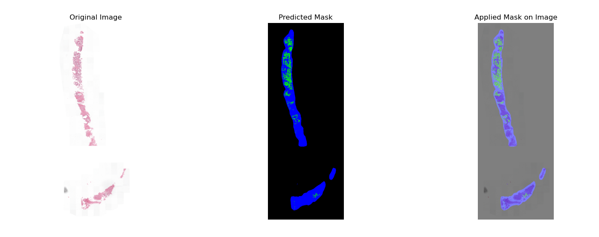
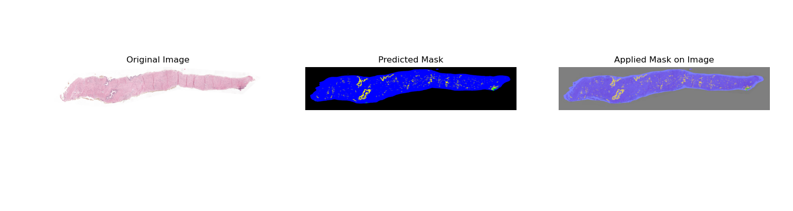
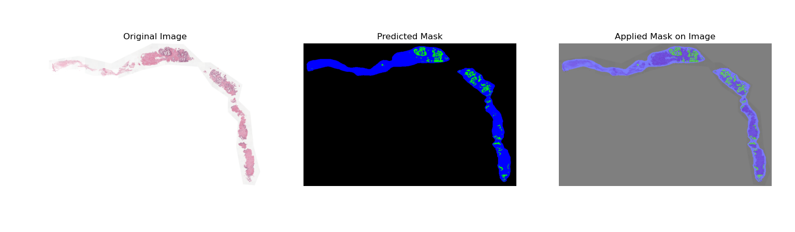
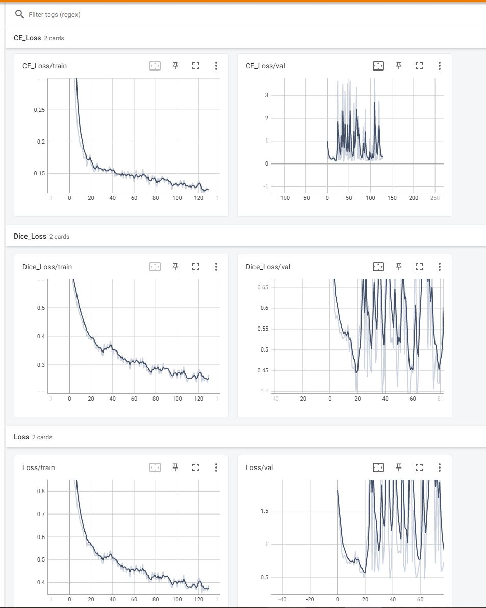
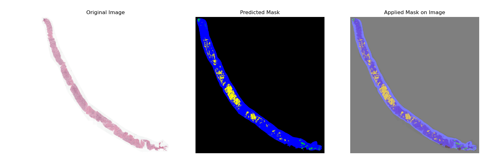
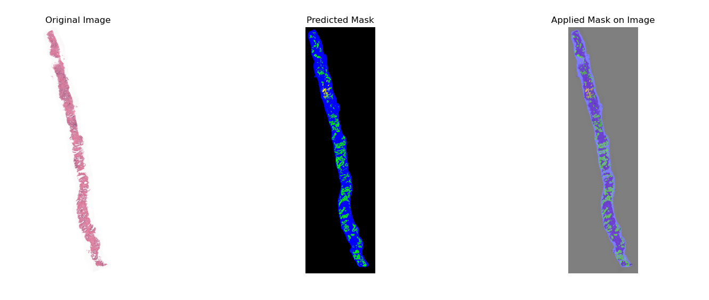
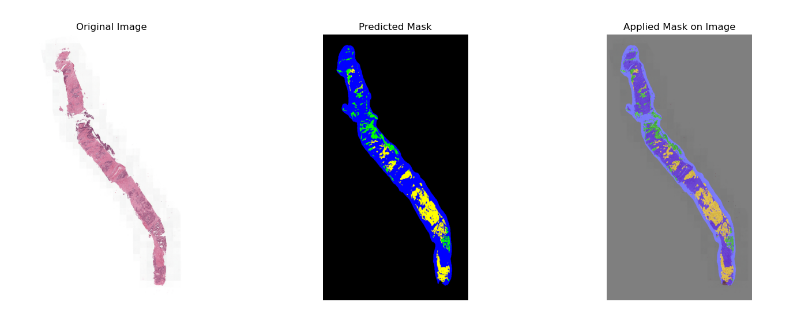

Model selection

Ref - https://medium.com/aiguys/attention-u-net-resunet-many-more-65709b90ac8b

U-Net and Variants:

Attention U-Net:

This network borrowed the idea of an attention mechanism from NLP and used it in skip connections. It gave the skip connections an extra idea of which region to focus on while segmenting the given object. This works great even with very small objects due to the attention present in the skip connections. This one is a little bit more complex to implement on your own from scratch but the idea behind this is quite ingenious and simple.

How the attention mechanism works is as follows:

The attention gate takes in two inputs, vectors x and g.

The vector, g, is taken from the next lowest layer of the network. The vector has smaller dimensions and better feature representation, given that it comes from deeper into the network.

In the example figure above, vector x would have dimensions of 64x64x64 (filters x height x width) and vector g would be 32x32x32.

Vector x goes through a stridded convolution such that its dimensions become 64x32x32 and vector g goes through a 1x1 convolution such that its dimensions become 64x32x32.

The two vectors are summed element-wise. This process results in aligned weights becoming larger while unaligned weights becoming relatively smaller.

The resultant vector goes through a ReLU activation layer and a 1x1 convolution that collapses the dimensions to 1x32x32.

This vector goes through a sigmoid layer which scales the vector between the range [0,1], producing the attention coefficients (weights), where coefficients closer to 1 indicate more relevant features.

The attention coefficients are upsampled to the original dimensions (64x64) of the x vector using trilinear interpolation. The attention coefficients are multiplied element-wise to the original x vector, scaling the vector according to relevance. This is then passed along in the skip connection as normal.

Classes: 4 (including the background)

Training Data: 24 datasets

Testing Data: 6 datasets

Given your scenario with a relatively small dataset, using an Attention U-Net can help maximize performance by focusing on the relevant areas and potentially mitigating the impact of the limited training data.

Attention U-Net:

Encoder (Downsampling):

Convolutional blocks (CBRs): Two 3x3 convs, batch norm, ReLU.

Max-pooling for downsampling.

Bottleneck: CBR block at the U-Net's bottleneck.

Decoder (Upsampling):

Up-convolutions and CBR blocks for upsampling.

Concat with encoder features followed by Attention blocks.

Attention Blocks: Enhance focus on relevant spatial features.

Output Layer: 1x1 convolution to reduce channels to the number of classes.

Training Strategies

Loss Function: Combined loss (Cross-Entropy Loss + Dice Loss)

Cross-Entropy Loss: Measures discrepancy between predicted probabilities and true labels.

Soft Dice Loss: Measures overlap between predicted and true segmentation.

Optimizer: Adam with learning rate (1 \times 10^{-3}).

Epochs: 2000 epochs.

Model Checkpointing: Save model on the best validation loss.

Data Augmentation Techniques

Horizontal Flip

Vertical Flip

Rotation (±180 degrees)

Gaussian Blur

Shear Transformation

Hyperparameter Tuning Procedures

Batch Size: 4

Learning Rate: (1 \times 10^{-3})

Number of Epochs: 2000

Augmentation Probabilities: Balanced to prevent over-augmentation.

Initial Setup & Visualization

Visualization: Display random samples of original and augmented images with overlay masks.

TensorBoard: Logs metrics like loss, CE loss, and Dice loss for both training and validation.

Device Utilization

Device Check: Use GPU if available.

Evaluation:

color_to_class = {

(0, 0, 0): 0,      # Background (Black)

(0, 0, 255): 1,    # Stroma (Blue)

(0, 255, 0): 2,    # Benign (Green)

(255, 255, 0): 3   # Tumor (Yellow)

}

IoU for each class on validation set:

Class 0 IoU: 0.9741

Class 1 IoU: 0.7349

Class 2 IoU: 0.2977

Class 3 IoU: 0.1711

Outputs:

Detected Classes, Confidence Scores, and Total Pixels:

Class: (0, 0, 0), Confidence: 0.99, Pixels Detected: 233615

Class: (0, 0, 255), Confidence: 0.87, Pixels Detected: 24120

Class: (0, 255, 0), Confidence: 0.73, Pixels Detected: 340

Class: (255, 255, 0), Confidence: 0.77, Pixels Detected: 4069

Detected Classes, Confidence Scores, and Total Pixels:

Class: (0, 0, 0), Confidence: 0.99, Pixels Detected: 236974

Class: (0, 0, 255), Confidence: 0.90, Pixels Detected: 22267

Class: (0, 255, 0), Confidence: 0.84, Pixels Detected: 2899

Class: (255, 255, 0), Confidence: 0.46, Pixels Detected: 4

Detected Classes, Confidence Scores, and Total Pixels:

Class: (0, 0, 0), Confidence: 0.98, Pixels Detected: 151918

Class: (0, 0, 255), Confidence: 0.94, Pixels Detected: 103927

Class: (0, 255, 0), Confidence: 0.72, Pixels Detected: 213

Class: (255, 255, 0), Confidence: 0.78, Pixels Detected: 6086

Detected Classes, Confidence Scores, and Total Pixels:

Class: (0, 0, 0), Confidence: 0.99, Pixels Detected: 234666

Class: (0, 0, 255), Confidence: 0.89, Pixels Detected: 23635

Class: (0, 255, 0), Confidence: 0.85, Pixels Detected: 3843

Detected Classes, Confidence Scores, and Total Pixels:

Class: (0, 0, 0), Confidence: 0.99, Pixels Detected: 223609

Class: (0, 0, 255), Confidence: 0.90, Pixels Detected: 28202

Class: (0, 255, 0), Confidence: 0.83, Pixels Detected: 3567

Class: (255, 255, 0), Confidence: 0.81, Pixels Detected: 6766

Detected Classes, Confidence Scores, and Total Pixels:

Class: (0, 0, 0), Confidence: 0.99, Pixels Detected: 215980

Class: (0, 0, 255), Confidence: 0.91, Pixels Detected: 35815

Class: (0, 255, 0), Confidence: 0.89, Pixels Detected: 9880

Class: (255, 255, 0), Confidence: 0.62, Pixels Detected: 469

Model output:

